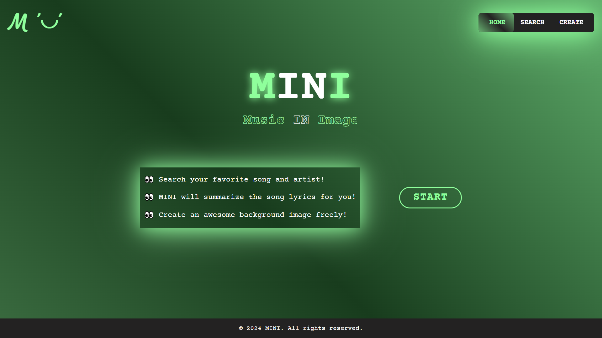
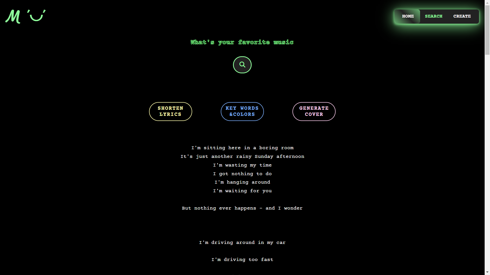
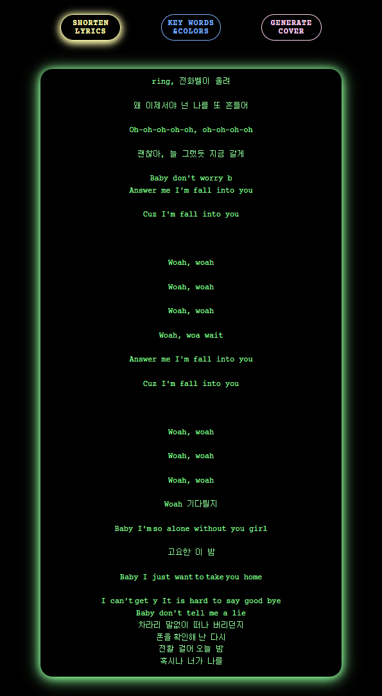
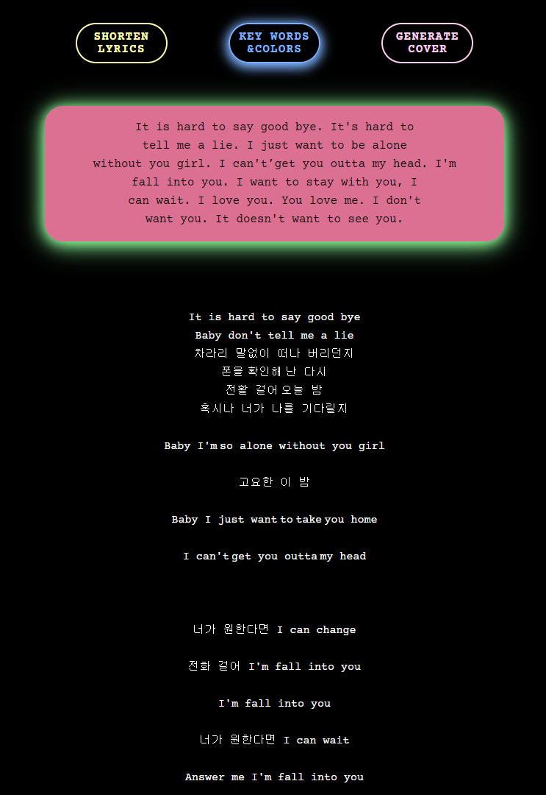
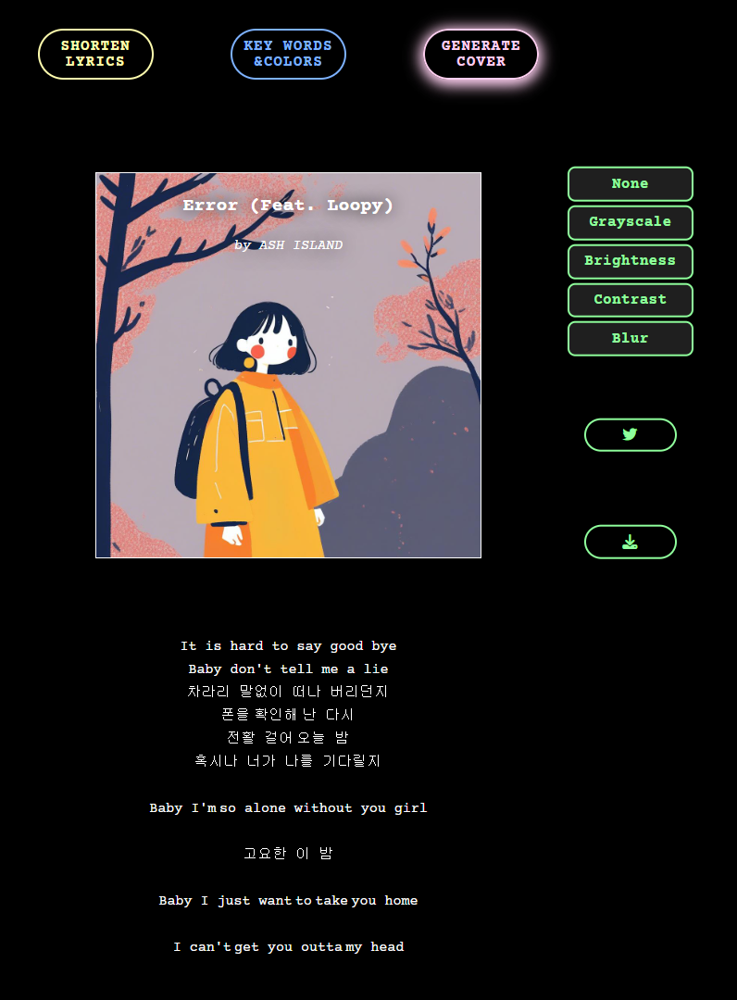
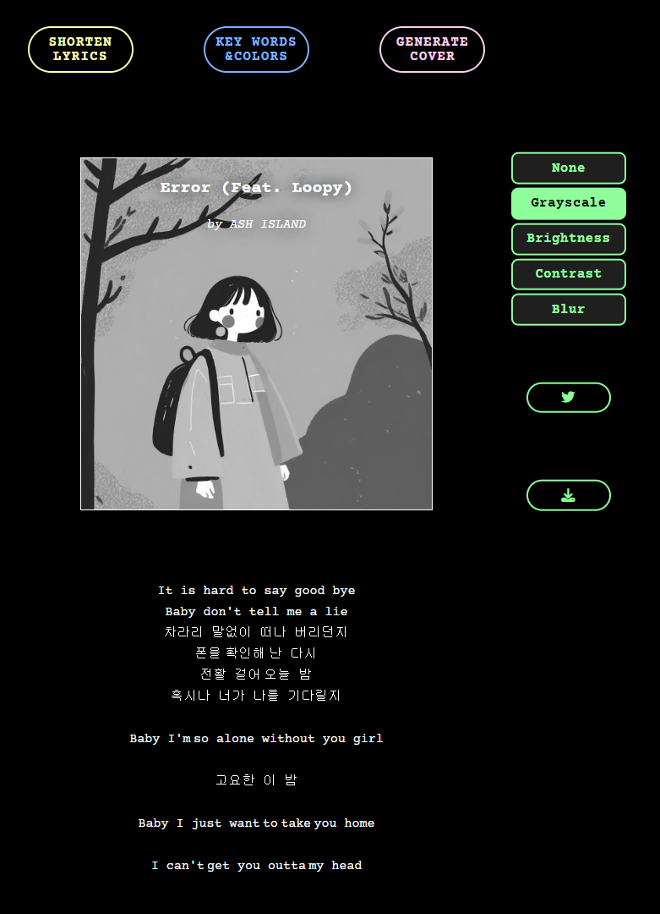
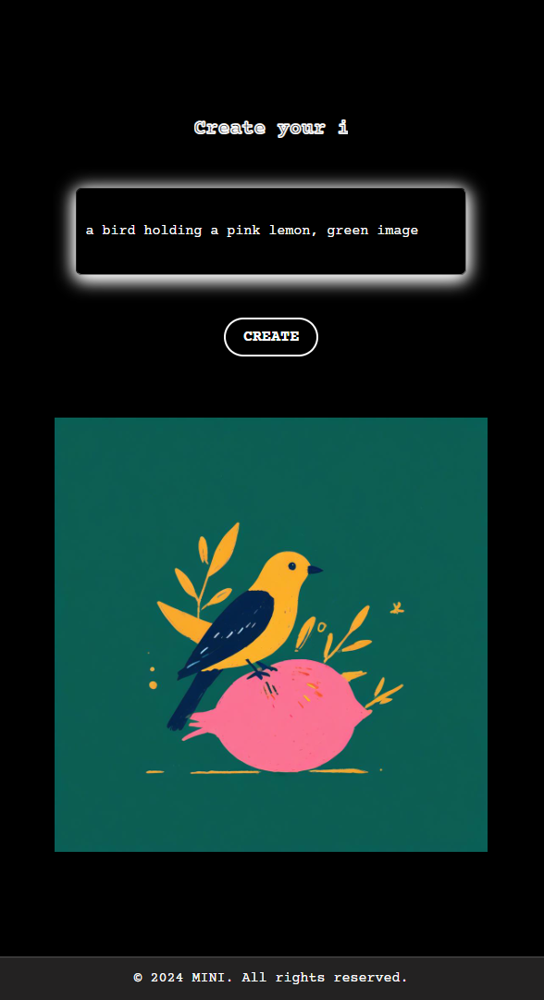

# 🖼 MINI: Music IN Image (Graduation Project)

## 📌 Overview

**MINI (Music IN Image)** is a Generative AI-based service that automatically creates **album covers from song lyrics**.  
As music streaming platforms grow rapidly, album art has become a key marketing element.  
MINI allows users to create high-quality covers based on lyrics, even without artistic or design expertise.

 

 

  

 

## 🎯 Motivation

- 📈 Rapid growth of the global **music streaming industry**
- 🎨 Rise of **AI-powered image generation** enables low-cost, high-quality album cover creation
- 😕 Many songs **lack meaningful cover art** or have covers that **don’t reflect the lyrics**
- ❤️ Personal desire to **visually capture the emotions of a favorite song**

> _"I wanted to turn my favorite lyrics into a memory I could see."_

 

## 🚀 Features

| Feature | Description |
|--------|-------------|
| 🔍 **Search Song** | Search lyrics by song title or artist name |
| 📃 **Lyrics Viewer** | View full lyrics |
| ✂️ **Lyrics Summary** | Automatically summarize the most important lines |
| 🎭 **Emotion Analysis** | Analyze the emotion and tone of lyrics |
| 🖼️ **Album Cover Generation** | Generate a cover image from lyrics with no prompt needed |
| 🎨 **Style Filters** | Apply filters to change the cover’s style |
| 📤 **Download & Share** | Download and share your custom album cover |
| ✏️ **Prompt-based Mode** | Create covers using custom prompts as well |

 

## 🌟 Why MINI?

- 🧠 Combines **lyric summary + emotion analysis + image generation**
- 🧑‍🎨 Enables **personalized album art** for artists and music lovers
- 🖼️ Covers can also be used as **lock screen wallpapers**
- 🎧 Simplifies the album cover creation process with an intuitive UI
  

## 🛠️ Tech Stack

- **Frontend:** HTML, CSS, JavaScript  
- **Backend:** Node.js  
- **Deployment:** GitHub, Netlify  
- **AI Services:** Hugging Face APIs
  

## 🌐 Live Demo

🔗 [Watch MINI Demo](https://drive.google.com/file/d/1osanaeQQAoIlfoFwTSunlzNfGSPBwob9/view?usp=drive_link)
  

## 👩‍💻 Developer Notes

This project was designed, developed, and deployed independently.
